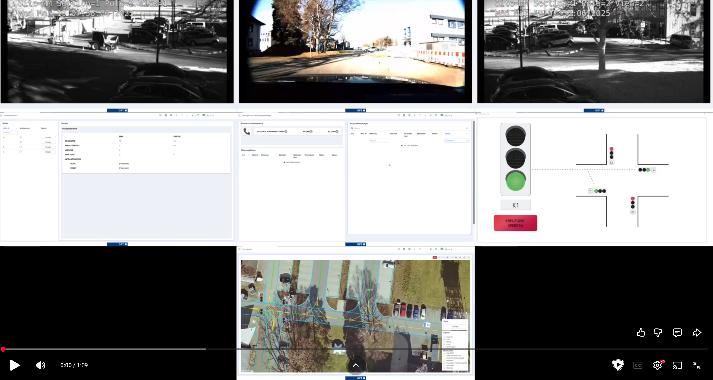

# Automated Driving Open Research (ADORe)

## About ADORe

Eclipse ADORe is a modular software library and toolkit for decision making, planning, control and simulation of 
automated vehicles. It is developed by [The German Aerospace Center (DLR), Institute for Transportation Systems 🔗](https://www.dlr.de/ts/en).
 - ADORe is [ROS 2 🔗](https://ros.org) based
 - ADORe is fully containerized using [Docker 🔗](https://docker.io)
  - ADORe is currently deployed on DLR TS institute research vehicles [FASCar 🔗](https://www.dlr.de/en/research-and-transfer/research-infrastructure/fascar-en) and [VIEWCar II🔗](https://www.dlr.de/en/research-and-transfer/research-infrastructure/view-car)
- ADORe is developed with algorithms and data models applied in real automated driving system for motion planning and control
- ADORe features mechanisms for safe interaction with other CAVs, infrastructure, traffic management, interactions with human-driven vehicles, bicyclists, pedestrians

ADORe is designed around both single agent automated driving (SAAD) and multi agent automated driving (MAAD), to allow both individual and cooperative driving behaviors.

# Documentation
In order to get started, it is advised to first check system requirements, follow the installation instruction and then
try out the demo scenarios.

- [Github Pages](https://eclipse.github.io/eclipse-adore/adore)
- [Getting started](documentation/technical_reference_manual/getting_started/getting_started.md)

## ADORe In Action

### ADORe Road Driving

### ADORe Remote Operations

### Simulated Multi-Agent Driving / planning

### ADORe at intelligent intersection

