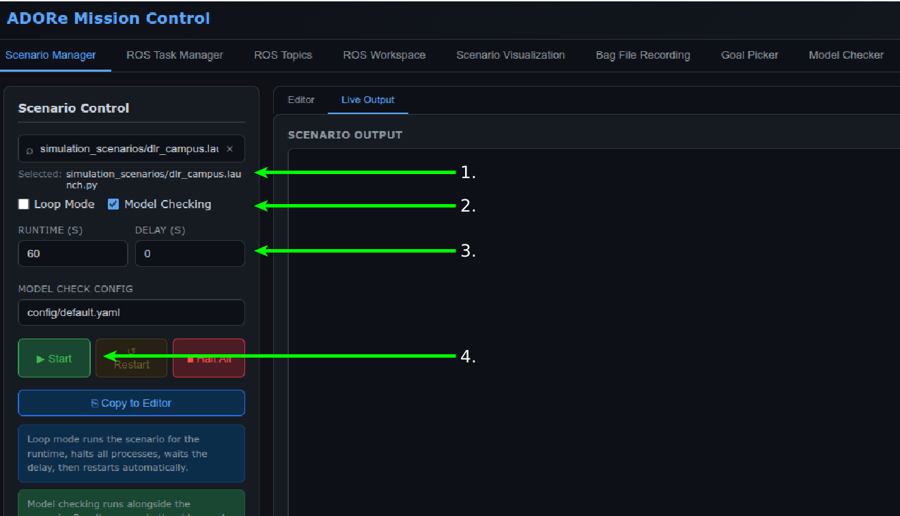
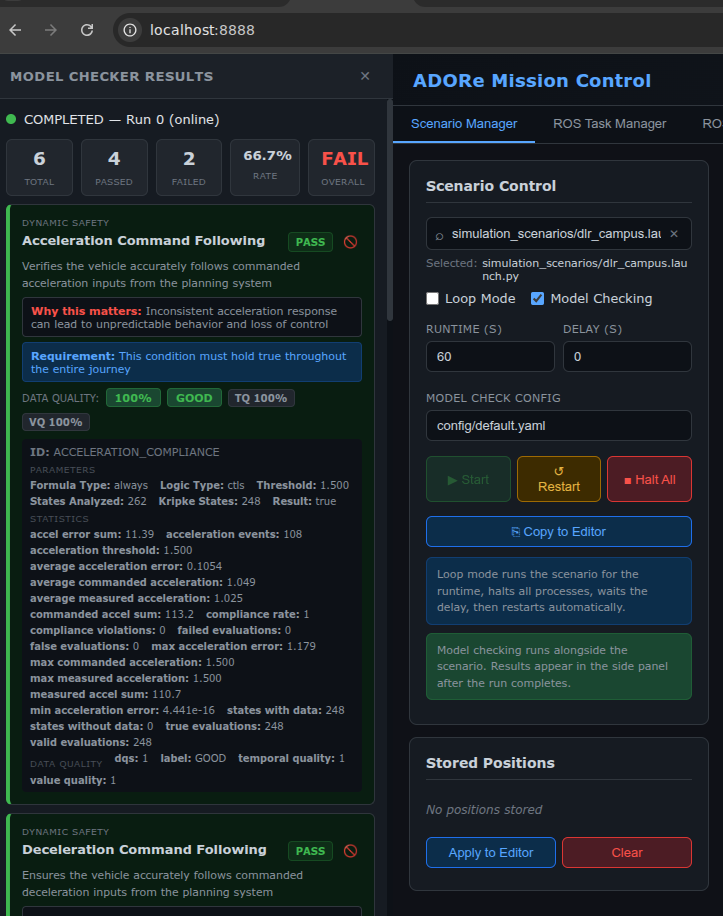
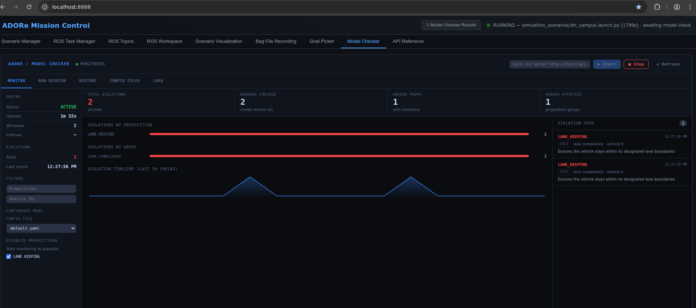

# ADORe Scenario Model Checking With The ADORe Mission Control

Online, offline model checking can be 

## Online model checking

Open the ADORe Mission Control Web Interface: [ADORe Mission Control Dashboard](http://localhost:8888)

1. Select a Scenario
2. Enable online model checking by checking the "Model Checking" check box
3. Select a sample time (the number of seconds data will be collected before model checking)
4. Click the "Play" button to run the scenario and start the model checking.

5. Wait for the results. Online model checking results will open in the results panel on the left once model checking has finished.

## Continuous model checking 
1. Following the same procedure as "Online model checking" select a scenario,
and click play.  
2. Click the "Model Checker" tab in the ADORe Mission Control dashboard.
3. Click "▶ Start" button.
4. Continuous model checking results will display in the "Model Checker" tab while a scenario is running

## Offline Model Checking 
TODO

