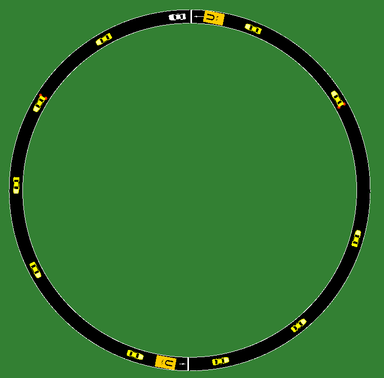
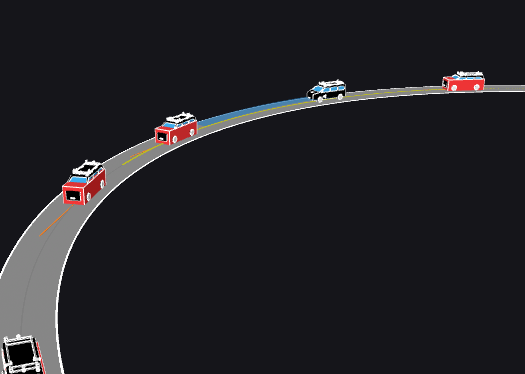
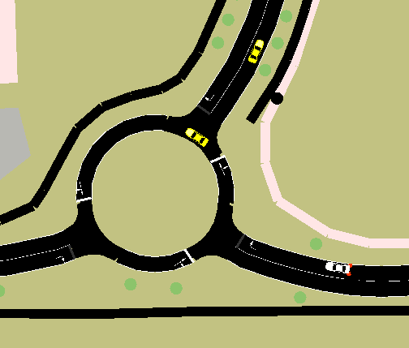
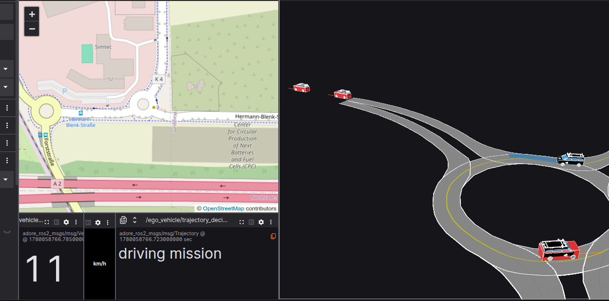

# ADORe and SUMO

This document describes how to get ADORe and SUMO running together using the `sumo_bridge` ROS 2 node.

## sumo_bridge ROS 2 node

The `sumo_bridge` is a ROS 2 node located in `ros2_workspace/src/adore_interfaces/sumo_bridge` that bridges [SUMO](https://sumo.dlr.de) traffic simulation to the ADORe stack via libsumo. SUMO vehicles are published as `TrafficParticipantSet` messages and the ego vehicle state is injected back into SUMO each simulation step.

## Quick Start

**Prerequisites**

- ADORe built: `make build`
- Lichtblick running: `cd tools/Lichtblick && make start`

**1. Start an interactive ADORe CLI session**

```bash
make cli
```

**2. Navigate to the simulation scenarios directory**

```bash
cd adore_scenarios/simulation_scenarios
```

**3. Launch a SUMO scenario**

For the synthetic 50 m circle track:

```bash
ros2 launch sumo_test.launch.py
```

For the georeferenced OSM scenario with live traffic:

```bash
ros2 launch sumo_example.launch.py
```

**4. Open Lichtblick in a Chromium-based browser**
Open [http://localhost:8080/?ds=rosbridge-websocket&ds.url=ws://localhost:9090&layout=Default.json](http://localhost:8080/?ds=rosbridge-websocket&ds.url=ws://localhost:9090&layout=Default.json) in a Chromium-based browser.


## Configuration via Environmental Variables

All variables are set in `adore.env`.

| Variable | Default | Description |
|---|---|---|
| `SUMO_BRIDGE_ENABLE` | `false` | Set to `true` to start the bridge |
| `SUMO_CONFIG_DIRECTORY` | `ros2_workspace/src/adore_interfaces/sumo_bridge/sumo_configs` | Path relative to `SOURCE_DIRECTORY` containing `.sumocfg` files |
| `SUMO_BRIDGE_CONFIG_FILE` | `demo_sumo_bridge.sumocfg` | Config filename. Sets `SUMO_CONFIG_FILE` in `adore.env` |
| `SUMO_HOME` | `/usr/share/sumo` | Path to SUMO installation |

## ROS Parameters

| Parameter | Type | Default | Description |
|---|---|---|---|
| `sumo_config_file` | `string` | `""` | Absolute path to the `.sumocfg` file. Required. |
| `sumo_step_length` | `double` | `0.05` | SUMO simulation step length in seconds |
| `use_gui` | `bool` | `false` | Launch `sumo-gui` instead of headless `sumo`. Starts immediately without requiring the play button. |
| `gui_settings_file` | `string` | `""` | Path to a SUMO GUI settings XML file |
| `gui_zoom` | `double` | `5000.0` | Initial zoom level for `sumo-gui` (percentage; 5000 ≈ 10 m street level) |
| `gui_follow_ego` | `bool` | `true` | Whether `sumo-gui` tracks and follows the ego vehicle |
| `ego_start_position` | `string` | `""` | Ego start position as `"lat,lon,psi"` (psi in radians CCW from east). Derives UTM zone/letter and SUMO coordinates automatically. Required for georeferenced scenarios; omit for local coordinate scenarios. |
| `ego_tracking_id` | `int` | `0` | Tracking ID of the ego vehicle, used for GUI follow and color assignment |
| `ego_vehicle_color` | `string` | `"255,255,0"` | Ego vehicle color as `"R,G,B"` or `"R,G,B,A"` with values 0–255 |
| `utm_zone` | `int` | `32` | UTM zone number. Used only when `ego_start_position` is not set. |
| `utm_letter` | `string` | `"U"` | UTM zone letter. Used only when `ego_start_position` is not set. |
| `use_geo_conversion` | `bool` | `true` | When `false`, bypasses UTM/geo conversion and treats all coordinates as SUMO-local. Set to `false` for synthetic scenarios. |
| `initial_traffic_count` | `int` | `0` | Number of SUMO traffic vehicles to spawn ahead of the ego at startup |
| `initial_traffic_spacing` | `double` | `20.0` | Distance in metres between each spawned traffic vehicle |

## Topics

| Topic | Type | Direction | Description |
|---|---|---|---|
| `traffic_participants` | `TrafficParticipantSet` | publish | SUMO vehicles converted to ADORe traffic participants |
| `vehicle_state/traffic_participant` | `TrafficParticipant` | subscribe | Ego vehicle state injected into SUMO each step |

## Scenarios

Two example scenarios are provided.

### circle50m (`sumo_test.launch.py`)

A synthetic 50 m radius circular track with no real-world georeferencing. Uses local SUMO coordinates directly with `use_geo_conversion: false`.

| SUMO GUI | ADORe / Lichtblick |
|---|---|
|  |  |

```bash
make cli
cd adore_scenarios/simulation_scenarios
ros2 launch sumo_bridge sumo_test.launch.py
```

### OSM example scenario (`sumo_example.launch.py`)

A georeferenced OpenStreetMap scenario. The ego start and goal are specified as lat/lon coordinates. Initial traffic vehicles are spawned ahead of the ego and follow randomised routes through the network including roundabouts.

| SUMO GUI | ADORe / Lichtblick |
|---|---|
|  |  |

```bash
make cli
cd adore_scenarios/simulation_scenarios
ros2 launch sumo_bridge sumo_example.launch.py
```

## Clock Synchronisation

The bridge synchronises SUMO simulation time to the ROS wall clock. Reference times are captured after the first simulation step completes, ensuring both clocks are anchored at the same point. When `use_gui` is `true`, the `--start` flag is passed to `sumo-gui` so the simulation begins immediately without requiring the play button.

## Coordinate Conventions

| Convention | Details |
|---|---|
| ROS yaw (`yaw_angle`) | Radians, counter-clockwise from east |
| SUMO heading | Degrees, clockwise from north |
| SUMO `getPosition` | Returns front bumper; the bridge offsets by half vehicle length to publish and consume centre positions |
| Geo conversion | `convertGeo(lon, lat, ...)` -- argument order is longitude first |

## Initial Traffic Spawning

When `initial_traffic_count > 0` the bridge spawns SUMO-controlled vehicles ahead of the ego at startup. Spawn positions are walked along the actual lane geometry so vehicles land on the road regardless of curvature. Each vehicle receives a unique randomised route built by walking the routing graph forward from its spawn edge, weighted toward higher speed-limit roads. Routes are deterministic per vehicle ID across runs.
